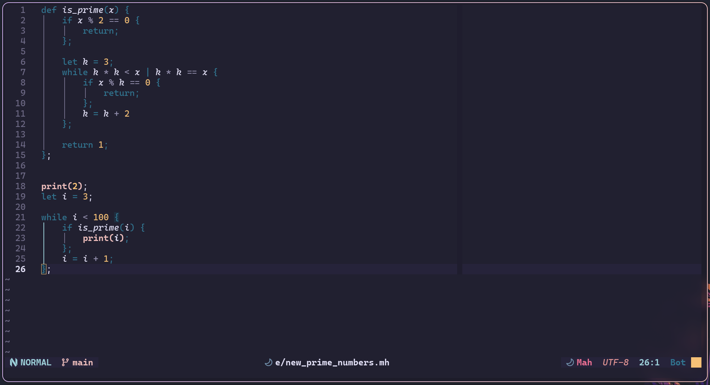

# The Mah Language

> A beautiful language

## Getting Started

```sh
# first generate language by running python ./compiler-generator/generate.py <input_file>

python ./compiler-generator/generate.py ./mah.lang

# or

make lang

# import parser, lexer, and ir_generator from compiler module and implement
# required actions

# then get the result how ever you want

python ./mah.py ./examples/input.mh

# or you can see the generated code with
python ./mah.py build ./examples/input.mh

# or to read from input.txt and write to output.txt, simply run:
python mah.py


```

## Examples:

To see the language in action, you can check out the `examples` folder.

```sh
python mah.py examples/new_prime_numbers.mh
```

## Syntax highlighting in neovim

you can install the `syntax-highlight` folder as a neovim plugin (then you need to TSInstall it), then copy the `queries` folder inside of it into nvim config root to have syntax highlighting in `.mh` files.


