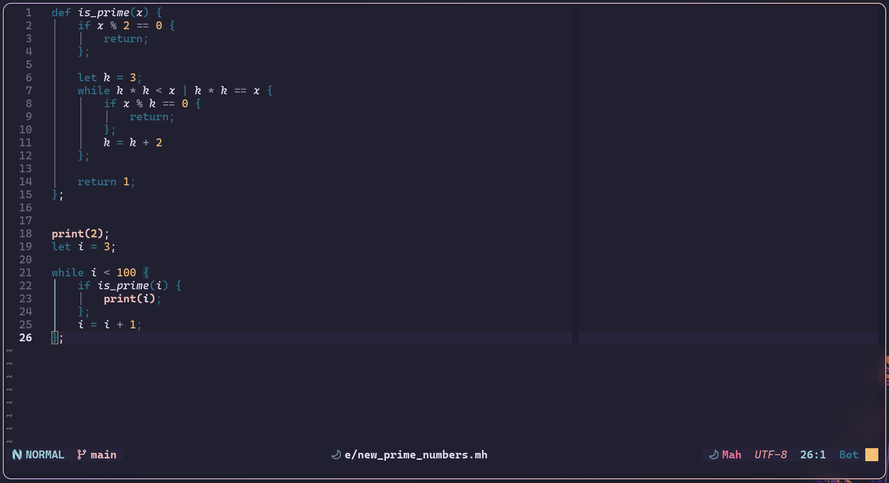

# The Mah Language

> ماه — "moon" in Persian.

Mah is a small programming language built entirely from scratch: a
hand-written lexer, recursive-descent parser, resolver, bytecode compiler,
and a tree-walking VM, plus a real LSP server and editor integrations for
Neovim and VS Code — **every one of them pure Python**, standard library
only, with zero third-party runtime dependencies anywhere in the toolchain.

## Why it's built this way

Mah exists as a from-the-ground-up exploration of how a language and its
tooling actually work, so a few choices run through the whole project on
purpose:

- **Pure Python, standard library only.** The lexer, parser, resolver,
  codegen, VM, and the LSP server import nothing beyond `python3`'s own
  stdlib — no parser-generator library, no LSP framework, no third-party
  CLI library (the `mah` command's `run`/`build`/`lsp` subcommands are
  plain `argparse`). Clone the repo, and everything runs with nothing to
  `pip install`. The only place this project reaches for `npm`/Node is the
  optional VS Code extension client, since that's simply what a VS Code
  extension is — the language server it talks to is still pure Python.
- **Hand-written, not generated.** There's no grammar DSL feeding a parser
  generator (an earlier version of this project worked that way — see
  `compiler-generator/` and `docs/GRAMMAR_DSL.md`, kept only as history).
  The current compiler is entirely hand-written, which is slower to build
  by hand but means every stage is something you can actually read and
  reason about end to end.
- **Heap-allocated closures over a native call stack.** Every function
  call gets a heap-allocated `Frame`, linked to its lexically enclosing
  frame by a static chain pointer (and, at runtime, a caller-return chain
  — the classic SCP/DCP activation-record technique). This is what lets
  Mah closures capture outer variables **by reference, like JavaScript**
  (not by value/name like Python) — a closure that outlives the call that
  created it still sees later mutations of its captured variables. There's
  no garbage collector yet, but the object model (heap `Frame`s,
  `Closure`s, `StructInstance`s, `EnumInstance`s, all with reference
  semantics) is deliberately shaped so one can be added later without a
  redesign.
- **A forgiving parser, for tooling's sake.** The parser recovers from a
  syntax error instead of aborting the whole parse, producing an `ErrorNode`
  in place of what it couldn't read and continuing — so the language
  server can report every mistake in a file in one pass, not just the
  first one. (Running a file, as opposed to editing it, still refuses
  outright if there's any parse error.)

## A quick tour

```mah
# variables, structs, and closures that capture by reference
let counter = fn() {
    let count = 0
    return fn() {
        count = count + 1
        return count
    }
}
let next = counter()
print(next())   # 1
print(next())   # 2

struct Point { x, y }
fn add(a, b) {
    return Point { x: a.x + b.x, y: a.y + b.y }
}
let p = add(Point { x: 1, y: 2 }, Point { x: 3, y: 4 })
print(p)        # Point { x: 4, y: 6 }

# enums (unit or struct-shaped variants), plus the built-in Option type
enum Shape {
    Circle { r },
    Square { s },
    Empty
}

fn area(s) {
    match s {
        Shape.Circle { r } => { 3 * r * r }
        Shape.Square { s } => { s * s }
        Shape.Empty => { 0 }
    }
}
print(area(Shape.Circle { r: 5 }))

fn half(n) {
    if n % 2 == 0 { return some(n // 2) }
    return none
}
match half(7) {
    some(v) => { print(v) }
    none => { print("no half for an odd number") }
}

# if/match/bare blocks are expressions, and a function body is just a
# block -- so its trailing expression is its implicit return value
fn abs(n) {
    if n < 0 { -n } else { n }
}

# defer -- Zig-style, block-scoped, LIFO, runs on every exit path
struct Resource { name }
fn open(name) {
    print("opening " + name)
    return Resource { name: name }
}
fn close(r) {
    print("closing " + r.name)
}
fn process(name) {
    let r = open(name)
    defer close(r)          # runs whether this returns early or falls through
    if r.name == "bad" {
        return
    }
    print("using " + r.name)
}
process("alpha")   # opening alpha / using alpha / closing alpha
process("bad")     # opening bad / closing bad -- close() still ran
```

See `examples/*.mh` for many more (structs, enums, pattern matching,
expression blocks, `defer`, closures/recursion, imports, string handling,
number-base conversions) and `docs/V2_DESIGN.md` for the full language
design writeup, milestone by milestone.

### Modules

```mah
# mathlib.mh
export fn square(n) { return n ** 2 }
export let answer = 42

fn helper() { return 1 }    # private: not visible to importers
export helper                # ...unless explicitly exported
```

```mah
import math from "mathlib"   # namespaced -- math.square(4), math.answer
# or
import "mathlib"             # flat -- square(4) directly in scope
```

Only `export`ed names are reachable; each file is inlined at most once, so
diamond imports and cycles are safe, and errors inside an imported file are
reported with their real `file:line:column`.

## Getting started

```sh
python -m mah run ./examples/prime_numbers.mh        # compile and run a file, from a repo checkout
python -m mah build ./examples/structs.mh            # compile to portable bytecode: structs.mahc
python -m mah build ./examples/structs.mh --target release -o out.mahc   # no debug info
python -m mah runc ./examples/structs.mahc           # run compiled bytecode
python -m mah dis ./examples/structs.mahc            # show it as readable instructions
python -m mah format ./examples                      # rewrite .mh files in the standard layout
```

`mah format` only ever changes whitespace, and checks that before writing
(`--check` lists files that would change instead; see `docs/FORMAT.md`).

`mah <file>` (no subcommand) is shorthand for `mah run <file>` (or `mah
runc` for a `.mahc` file). The `.mahc` format is specified in
`docs/MAHC_FORMAT.md`, in enough detail to write a VM for it in any
language.

### Projects

```sh
mah init my-app        # or `mah init` to turn the current directory into a project
cd my-app
mah run                # runs the entry point from mah-project.toml (src/main.mh)
mah build              # writes every [[target]], e.g. build/my-app.mahc
mah build --target release
```

`mah init` creates `mah-project.toml` (package name, version, entry point,
and build targets, each with a `debug` or `release` profile), `src/main.mh`,
a `.gitignore`, and docs for coding agents: `AGENTS.md` (plus a `CLAUDE.md`
that imports it) and `docs/mah-language.md`, a complete language reference
written so an LLM can write correct Mah without guessing. `mah run` and
`mah build` find the manifest from any subdirectory. The templates live in
`mah/project/templates/` and must be kept in sync with the language (see
`.claude/skills/mah-add-feature/SKILL.md` step 9). `[dependencies]` is
reserved for third-party packages, which aren't supported yet.

### Installing the `mah` command

```sh
make install-mah      # installs into ~/.local/lib/mah, links ~/.local/bin/mah
make uninstall-mah
```

(`PREFIX` defaults to `~/.local` — make sure `~/.local/bin` is on your
`PATH`.) Afterwards, from anywhere:

```sh
mah path/to/program.mh
mah build path/to/program.mh
mah init my-app
mah lsp                # starts the language server (see below) -- editors run this for you
```

## Editor support

### Neovim

```sh
make install-nvim      # tree-sitter syntax highlighting + the LSP ftplugin
make uninstall-nvim
```

This builds the `syntax-highlight/` tree-sitter grammar into your Neovim
config and drops in an ftplugin that starts the language server (`mah lsp`)
for every `.mh` buffer via `vim.lsp.start` — so `make install-mah` needs to
run first (or just run `make install`, which installs both, in order).



### VS Code

A VS Code extension lives in `editors/vscode/` — a TextMate grammar for
syntax highlighting, the same `mah lsp` server wired in as an LSP client,
and a custom file icon for `.mh` files. Build and install it locally with:

```sh
make build-vscode
code --install-extension editors/vscode/mah-language-*.vsix
```

See `editors/vscode/README.md` for details (not yet published to the
Marketplace).

### Any other editor

Any LSP client can run the server directly over stdio:

```sh
mah lsp
```

Point your editor's LSP client at that command for `.mh` files.

## The language server

`mah lsp` is a dependency-free (standard library only) implementation of
the Language Server Protocol, built directly on the same resolver the
compiler uses — not a second, independent analysis of the source. It
currently provides:

- live diagnostics as you type, including syntax and resolve errors inside
  imported files
- hover, with docs for keywords, builtins, and the declaration a variable/
  function/parameter resolved to
- go to definition — scope-aware (locals, then globals), and it follows
  imports: jumping from a namespaced call, the namespace name itself, or
  an `import` path string, into the file it points at
- rename (single-file only for now — see `docs/NEXT_PHASES.md` for what
  cross-file rename and struct/enum/field rename would take)
- document formatting, the same as `mah format`

(Completion, document symbols, and code actions existed in an earlier
version of the server and are currently disabled pending a rewrite onto
the same resolver-backed foundation as the features above — not yet
reintroduced.)

## Testing

```sh
make test
```

Runs the full suite (stdlib `unittest`, no extra dependencies) — every
language feature and LSP capability above ships with automated tests, not
just an example file; see `docs/TESTING.md`.

## How it's built

```
source --> preprocessor --> lexer --> parser --> resolver --> codegen --> VM
           (imports)                  (AST)      (scopes,      (flat IR)  (tree-walking
                                                   addresses)              interpreter)
```

- `mah/preprocessor.py` inlines `import`/`export` directives into one
  combined source text (tracking original file positions for error
  messages), before anything else runs.
- `mah/compiler/lexer.py` / `parser.py` hand-write tokenizing and a
  recursive-descent parse into an AST (`ast_nodes.py`), recovering from
  syntax errors instead of aborting (see "A forgiving parser" above).
- `mah/compiler/resolve.py` walks the AST once, assigning every variable a
  `(depth, slot)` address relative to its enclosing function's frame, and
  building the symbol table the LSP's hover/definition/rename read
  directly.
- `mah/compiler/codegen.py` lowers the AST into a flat, 3-address bytecode
  array.
- `mah/code_interpreter.py` runs that bytecode: heap `Frame`s linked by a
  static chain pointer for lexical scoping and closures (see "Heap-
  allocated closures" above), an explicit return-address stack for calls,
  and tagged heap values for structs/enums.

`docs/V2_DESIGN.md` is the full design document — every language feature
above landed as its own milestone (M0 through M9) with the reasoning,
deviations, and test coverage for each written up in place.

## Where this is going

Not yet built, but designed for and tracked in `docs/NEXT_PHASES.md`:

- **Match guards** (`pattern if condition => { ... }`)
- **Arrays / lists**
- **Generics**
- **Traits / interfaces**
- **A runtime type system** — types as ordinary values you can pass
  around, narrow with the language's own `if`/`match`, and inspect at
  runtime, rather than a separate static type-checker bolted on top
- **Async** (`detach` / `.await`) — a JS-style event loop where only real
  I/O ever triggers scheduling, not `detach` itself (there's a validated
  prototype for this model already, see `docs/prototypes/async_model.py`)
- **Cross-file rename** and **struct/enum/field rename** in the LSP
- A garbage collector, once the above settle enough that the heap object
  model they need is stable

## Docs

- `docs/V2_DESIGN.md` — the language design doc and milestone-by-milestone
  build log
- `docs/NEXT_PHASES.md` — detailed design notes for everything in
  "Where this is going" above
- `docs/TRAITS.md` — traits, `impl`, method dispatch, and system traits
- `docs/MAHC_FORMAT.md` — the portable `.mahc` bytecode format (normative)
- `docs/TESTING.md` — the testing policy referenced above
- `docs/DEVELOPMENT_WORKFLOW.md` — how this project's own development is
  split across planning, implementation, and verification
