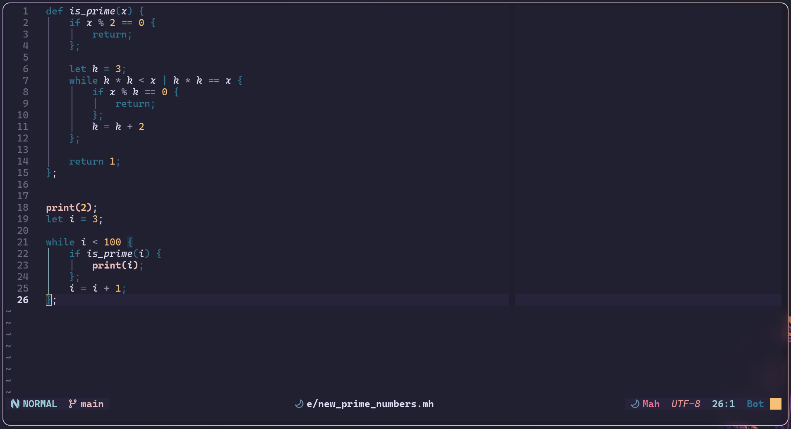

# The Mah Language

> ماه — "moon" in Persian.

Mah is a small programming language built from scratch, with a hand-written
compiler, a portable bytecode VM, a static type checker, a standard
library, reflection, an LSP server, a formatter, and editor integrations
for Neovim and VS Code.

- **Language:** structs, enums, pattern matching, traits, closures that
  capture by reference, lazy iterators, `async`-style `detach`/`.await`,
  `defer`, typed `throw`/`try`/`catch` errors, decorators, and runtime
  reflection.
- **Types:** optional annotations, generics, and a static checker that
  infers most types (including which errors a function can throw). Types
  never change what a program does at runtime.
- **Two runtimes for one bytecode format:** the compiler emits portable
  `.mahc` bytecode (fully specified in `docs/MAHC_FORMAT.md`), which runs on
  a Python VM or on a native Rust VM. The Rust VM can also produce a single
  self-contained executable.
- **Standard library:** `std:math`, `json`, `csv`, `path`, `regex`,
  `random`, `collections`, `time`, `async`, `fs`, `process`, `reflect`, and
  `test`, mostly written in Mah itself.
- **Tooling:** `mah run`/`build`/`check`/`test`/`format`/`init`, project
  manifests, and `mah lsp` (diagnostics, typed hover, completion, go to
  definition, cross-file rename, formatting).

Website and docs: [mahlang.dev](https://mahlang.dev).

## Why it's built this way

Mah is a from-the-ground-up exploration of how a language and its tooling
actually work, so a few choices run through the whole project on purpose:

- **Hand-written, not generated.** Lexer, recursive-descent parser,
  resolver, type checker, codegen, and formatter are all written by hand.
  There's no grammar DSL feeding a parser generator. An earlier version
  of this project worked that way; `compiler-generator/` and
  `docs/GRAMMAR_DSL.md` are kept only as history. It's slower to build,
  but every stage is something you can read end to end.
- **Few dependencies.** The compiler, Python VM, formatter, and language
  server use only the Python standard library: no parser library, no LSP
  framework, no CLI library. Clone the repo and `python -m mah` works with
  nothing to `pip install`. The Rust runtime uses the Rust standard library
  plus the `regex` crate. The only Node code is the optional VS Code
  extension client and the website.
- **The bytecode is the contract.** Both VMs run only `.mahc`, and its
  format is written down in enough detail to implement a third VM in any
  language. The two existing ones run the same test suite.
- **Heap-allocated closures over a native call stack.** Every function
  call gets a heap-allocated `Frame` linked to its lexically enclosing
  frame by a static chain pointer (the classic SCP/DCP activation-record
  technique). That's what lets closures capture outer variables **by
  reference, like JavaScript**: a closure that outlives its call still sees
  later changes to what it captured. There's no garbage collector yet, but
  the object model is shaped so one can be added without a redesign.
- **A forgiving parser, for tooling's sake.** The parser recovers from a
  syntax error instead of stopping, so the language server can report
  every mistake in a file in one pass. (Running a file still refuses
  outright if there's any parse error.)

## A quick tour

```mah
# closures capture by reference
let counter = fn() {
    let count = 0
    fn() {
        count = count + 1
        count
    }
}
let next = counter()
print(next())   # 1
print(next())   # 2

# structs, enums, pattern matching
struct Point { x, y }
enum Shape {
    Circle { r },
    Square { s },
    Empty
}

fn area(s) {
    match s {
        Shape.Circle { r } => { 3 * r * r }
        Shape.Square { s } => { s * s }
        Shape.Empty => { 0 }
    }
}
print(area(Shape.Circle { r: 5 }))      # 75

# if/match/blocks are expressions; a function body's last expression is
# its return value
fn abs(n) { if n < 0 { -n } else { n } }

# defer: block-scoped, LIFO, runs on every exit path
fn process(name) {
    print("opening " + name)
    defer print("closing " + name)
    if name == "bad" { return }
    print("using " + name)
}
process("bad")     # opening bad / closing bad
```

Traits, iterators, collections, keyword arguments, and async:

```mah
struct Rect { w, h }
trait Shape {
    fn area(self)
    fn describe(self) { "a shape with area " + self.area() }
}
impl Shape for Rect {
    fn area(self) { self.w * self.h }
}
print(Rect { w: 2, h: 3 }.describe())   # a shape with area 6

let odd_squares = (1..=5).map(fn(n) { n * n }).filter(fn(n) { n % 2 == 1 }).reduce()
print(odd_squares)                      # [1, 9, 25]
let ages = ["ada": 36, "alan": 41]
for let name, let i in ages {
    print(i, name, ages[name])          # 0 ada 36, then 1 alan 41
}

fn greet(name, greeting = "Hello") { greeting + ", " + name + "!" }
print(greet("Mah", greeting: "Salam"))  # Salam, Mah!

fn slow(n) { sleep_async(10); n * 2 }
let a = detach slow(21)
let b = detach { sleep_async(5); "from a block" }
print(a.await, b.await)                 # 42 from a block
```

Types and errors. Annotations are optional. The checker infers the rest,
including which errors each function can throw, and `mah check` reports
anything left unhandled:

```mah
fn first<T>(v: Vector<T>) -> T { v[0] }
print(first([7, 8]))                    # 7

enum ParseError { Empty, BadDigit }
impl Error for ParseError {}

fn first_digit(s: String) -> String {   # inferred: throws ParseError
    if s.len() == 0 { throw ParseError.Empty }
    let c = s.char_at(0)
    if c < "0" | c > "9" { throw ParseError.BadDigit }
    c
}

print(try { first_digit("") } catch {
    ParseError.Empty => { "was empty" }
    e: ParseError => { "other: " + e.message() }
})                                      # was empty
print(try first_digit("x") else "none") # none
```

Decorators and reflection. A decorator is a plain value attached to a
declaration, and `std:reflect` reads it back along with the declaration's
written types and doc comments. A decorator whose type implements a hook
trait can also wrap a function, transform an argument, or validate a
struct:

```mah
import reflect from "std:reflect"

struct Route { method: String, path: String }
fn get(path: String) -> Route { Route { method: "GET", path: path } }

## Fetch one user.
@get("/users/{id}")
fn get_user(id: Number, verbose: Bool = false) -> Number { id }

let sig = reflect.signature(get_user)
print(sig.doc)                          # Fetch one user.
match reflect.find(sig.decorators, Route) {
    some(route) => { print(route.method, route.path) }   # GET /users/{id}
    none => { print("not a route") }
}
```

See `examples/*.mh` for much more (modules, strings, files, processes,
regex, JSON/CSV, timers, hooks, tests), and the docs listed at the end.

### Modules

```mah
# mathlib.mh
export fn square(n) { n ** 2 }
export let answer = 42
fn helper() { 1 }            # private: not visible to importers
```

```mah
import math from "mathlib"   # namespaced: math.square(4), math.answer
import "mathlib"             # or flat: square(4) directly in scope
import json from "std:json"  # standard library modules use the std: prefix
```

Only `export`ed names are reachable. Each file is included at most once, so
diamond imports and cycles are safe, and errors inside an imported file are
reported with their real `file:line:column`.

## Getting started

```sh
python -m mah run ./examples/prime_numbers.mh        # compile and run a file, from a repo checkout
python -m mah build ./examples/structs.mh            # compile to portable bytecode: structs.mahc
python -m mah build ./examples/structs.mh --target release -o out.mahc   # no debug info
python -m mah runc ./examples/structs.mahc           # run compiled bytecode
python -m mah dis ./examples/structs.mahc            # show it as readable instructions
python -m mah format ./examples                      # rewrite .mh files in the standard layout
python -m mah check ./examples/structs.mh            # run the static type checker
```

`mah format` only ever changes whitespace, and checks that before writing
(`--check` lists files that would change instead; see `docs/FORMAT.md`).

There's also a native runtime written in Rust (standard library only, plus
the `regex` crate for `std:regex`), with the same behavior as the Python VM:

```sh
make vm                                              # build it (needs cargo)
python -m mah run --vm rust ./examples/structs.mh    # run on it (also: runc --vm rust)
python -m mah build --self-contained ./examples/structs.mh -o structs
./structs                                            # one file, runs without mah installed
```

A self-contained build is a small shell script with the runtime and the
bytecode appended; it runs on machines with the same OS and CPU. See
`docs/RUST_VM.md`.

`mah <file>` (no subcommand) is shorthand for `mah run <file>` (or `mah
runc` for a `.mahc` file). `mah build` output starts with a
`#!/usr/bin/env -S mah runc` line and is marked executable, so with `mah` on
your `PATH` you can run it directly: `./structs.mahc`. The `.mahc` format is specified in
`docs/MAHC_FORMAT.md`, in enough detail to write a VM for it in any
language.

### Projects

```sh
mah init my-app        # or `mah init` to turn the current directory into a project
cd my-app
mah run                # runs the entry point from mah-project.toml (src/main.mh)
mah build              # writes every [[target]], e.g. build/my-app.mahc
mah build --target release
mah check              # runs the static type checker, at the project's [types] check level
mah test               # runs every *.test.mh file (std:test; see docs/MAH_TEST.md)
```

`mah init` creates `mah-project.toml` (package name, version, entry point,
and build targets, each with a `debug` or `release` profile and optionally
`self-contained = true` for a standalone executable; `[run] vm = "rust"`
makes `mah run` use the Rust runtime; `[types] check` sets the static
type-checking level -- `"loose"` (default, warnings only), `"strict"`
(compile errors), or `"explicit"` (`"strict"` plus required annotations
where types can't be inferred) -- see `mah check` above), `src/main.mh`,
a `.gitignore`, and docs for coding agents: `AGENTS.md` (plus a `CLAUDE.md`
that imports it) and `docs/mah-language.md`, a complete language reference
written so an LLM can write correct Mah without guessing. `mah run` and
`mah build` find the manifest from any subdirectory. The templates live in
`mah/project/templates/` and must be kept in sync with the language (see
`.claude/skills/mah-add-feature/SKILL.md` step 9). `[dependencies]` is
reserved for third-party packages, which aren't supported yet.

### Installing the `mah` command

```sh
make install-mah      # installs into ~/.local/lib/mah, links ~/.local/bin/mah
                      # (run `make vm` first to install the Rust runtime too)
make uninstall-mah
```

(`PREFIX` defaults to `~/.local` — make sure `~/.local/bin` is on your
`PATH`.) Afterwards, from anywhere:

```sh
mah path/to/program.mh
mah build path/to/program.mh
mah init my-app
mah lsp                # starts the language server (see below) -- editors run this for you
```

## Editor support

### Neovim

```sh
make install-nvim      # tree-sitter syntax highlighting + the LSP ftplugin
make uninstall-nvim
```

This builds the `syntax-highlight/` tree-sitter grammar into your Neovim
config and drops in an ftplugin that starts the language server (`mah lsp`)
for every `.mh` buffer via `vim.lsp.start` — so `make install-mah` needs to
run first (or just run `make install`, which installs both, in order).



### VS Code

A VS Code extension lives in `editors/vscode/` — a TextMate grammar for
syntax highlighting, the same `mah lsp` server wired in as an LSP client,
and a custom file icon for `.mh` files. Build and install it locally with:

```sh
make build-vscode
code --install-extension editors/vscode/mah-language-*.vsix
```

See `editors/vscode/README.md` for details (not yet published to the
Marketplace).

### Any other editor

Any LSP client can run the server directly over stdio:

```sh
mah lsp
```

Point your editor's LSP client at that command for `.mh` files.

## The language server

`mah lsp` implements the Language Server Protocol using only the Python
standard library, on top of the same resolver and type checker the
compiler uses, not a second analysis of the source. It provides:

- live diagnostics as you type: syntax, resolve and type errors, including
  ones inside imported files
- hover: docs for keywords and builtins, inferred types, the declaration a
  name resolved to (with its doc comment), struct/enum shapes, and trait
  and method signatures
- completion: keywords, builtins, names in scope, imported and namespaced
  names, methods/fields after a `.` based on the receiver's type, and `.mh`
  files and `std:` modules inside an `import "..."` string
- go to definition, scope-aware and across imports
- rename: variables and functions across every file that imports them,
  and struct/enum/variant/field names (including in type annotations)
- document formatting, the same as `mah format`

## Testing

```sh
make test          # the Python implementation (stdlib unittest)
make test-rust     # the Rust runtime against the same programs
```

Every language feature and LSP capability ships with automated tests, not
just an example file; see `docs/TESTING.md`. (For testing *Mah programs*,
see `mah test` and `docs/MAH_TEST.md`.)

## How it's built

```
source --> preprocessor --> lexer --> parser --> resolver --> type checker
           (imports)                  (AST)      (scopes,     (advisory; never
                                                  addresses)   feeds codegen)
                                                      |
                                                      v
                                    codegen --> lower --> .mahc --> Python VM
                                   (flat IR)                    \-> Rust VM
```

- `mah/preprocessor.py` inlines `import`/`export` (and `std:` modules)
  into one combined source, keeping original file positions for errors.
- `mah/compiler/lexer.py` / `parser.py` tokenize and parse into an AST
  (`ast_nodes.py`), recovering from syntax errors.
- `mah/compiler/resolve.py` gives every variable a `(depth, slot)` address
  in its function's frame and builds the symbol table the LSP reads.
- `mah/compiler/typecheck.py` / `types.py` are the static checker:
  inference, generics, traits, and error sets. Its output is diagnostics
  only, so the bytecode is the same whatever it decides.
- `mah/compiler/codegen.py` lowers the AST into a flat IR, and
  `mah/bytecode/lower.py` turns that into `.mahc`.
- `mah/code_interpreter.py` is the Python VM; `runtime/` is the Rust VM
  (`mah-vm`). Both use heap `Frame`s with a static chain for closures,
  tagged heap values for structs/enums, and a single-threaded task
  scheduler for `detach`/`.await` and async I/O.
- `mah/std/*.mh` is the standard library, written in Mah over a small set
  of native functions (`extern fn`) that each VM implements.
- `mah/format/` is `mah format`, and `mah/lsp/` is the language server.

`docs/V2_DESIGN.md` and the per-feature design docs record every milestone
(M0 through M41c so far) with its reasoning, deviations, and test coverage.

## Where this is going

Next, mostly in service of a NestJS/FastAPI-style web framework written in
Mah (routes from decorators, request binding and OpenAPI from types):

- **`Bytes`**, then **`std:socket`**, **`std:url`** and an **HTTP client**
- **An HTTP server** (with form and multipart bodies)
- **Third-party packages** (`[dependencies]` in the manifest is already
  reserved for them)

Further out (`docs/NEXT_PHASES.md`, `docs/TYPES.md`): the rest of the
checker's trait and completion work, pattern matching on Vectors and
`match` exhaustiveness, nullable types, formatter settings in
`mah-project.toml`, document symbols and code actions in the LSP, and a
garbage collector.

## Docs

The website at [mahlang.dev](https://mahlang.dev) has the user-facing
guide and changelog. The design docs in this repo:

- `docs/V2_DESIGN.md`: the language design and milestone-by-milestone
  build log
- `docs/TYPES.md`: the static type system (syntax, inference, strictness
  levels, generics)
- `docs/ERRORS.md`: `throw`/`try`/`catch` and checked error sets
- `docs/TRAITS.md`: traits, `impl`, method dispatch, and system traits
- `docs/STDLIB.md`: the standard library, module by module
- `docs/REFLECTION.md`: type values, metadata, decorators, and hooks
- `docs/MAH_TEST.md`: `std:test` and `mah test`
- `docs/FORMAT.md`: `mah format` and its whitespace-only guarantee
- `docs/MAHC_FORMAT.md`: the portable `.mahc` bytecode format (normative)
- `docs/RUST_VM.md`: the Rust runtime, `--vm rust`, self-contained
  executables
- `docs/NEXT_PHASES.md`: design notes for future work
- `docs/TESTING.md`: how the implementation itself is tested
- `docs/DEVELOPMENT_WORKFLOW.md`: how this project's development is split
  across planning, implementation, and verification
